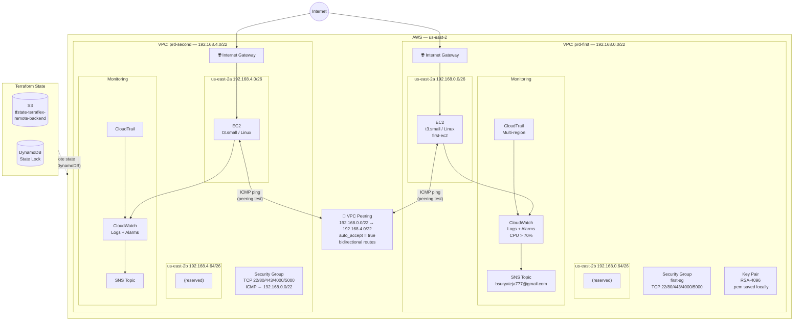
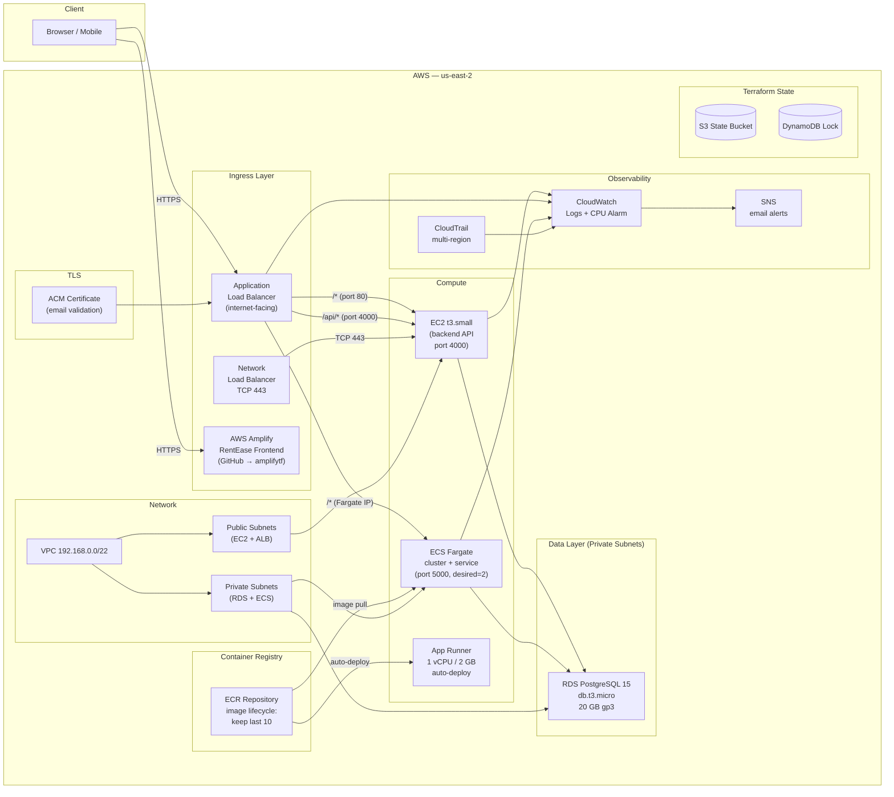
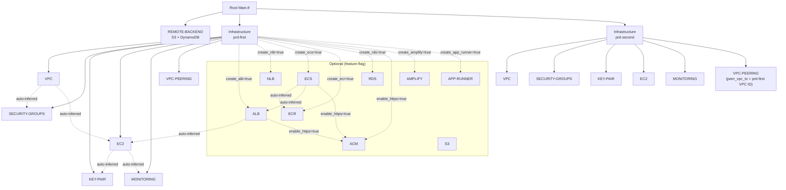

# TerraFlex — System Architecture Diagram

## Current Deployment (prd-first + prd-second)

```mermaid
graph TB
    Internet(("Internet"))

    subgraph TF["Terraform State"]
        S3B[("S3\ntfstate-terraflex-\nremote-backend")]
        DDB[("DynamoDB\nState Lock")]
    end

    subgraph AWS["AWS — us-east-2"]

        subgraph VPC1["VPC: prd-first  —  192.168.0.0/22"]
            IGW1["🌐 Internet Gateway"]

            subgraph PUB1A["us-east-2a  192.168.0.0/26"]
                EC2_1A["EC2\nt3.small / Linux\nfirst-ec2"]
            end

            subgraph PUB1B["us-east-2b  192.168.0.64/26"]
                direction TB
                SPARE1["(reserved)"]
            end

            SG1["Security Group\nfirst-sg\nTCP 22/80/443/4000/5000"]
            KP1["Key Pair\nRSA-4096\n.pem saved locally"]

            subgraph MON1["Monitoring"]
                CW1["CloudWatch\nLogs + Alarms\nCPU > 70%"]
                CT1["CloudTrail\nMulti-region"]
                SNS1["SNS Topic\nbsuryateja777@gmail.com"]
            end
        end

        PEER["🔗 VPC Peering\n192.168.0.0/22 ↔ 192.168.4.0/22\nauto_accept = true\nbidirectional routes"]

        subgraph VPC2["VPC: prd-second  —  192.168.4.0/22"]
            IGW2["🌐 Internet Gateway"]

            subgraph PUB2A["us-east-2a  192.168.4.0/26"]
                EC2_2A["EC2\nt3.small / Linux"]
            end

            subgraph PUB2B["us-east-2b  192.168.4.64/26"]
                direction TB
                SPARE2["(reserved)"]
            end

            SG2["Security Group\nTCP 22/80/443/4000/5000\nICMP ← 192.168.0.0/22"]

            subgraph MON2["Monitoring"]
                CW2["CloudWatch\nLogs + Alarms"]
                CT2["CloudTrail"]
                SNS2["SNS Topic"]
            end
        end

    end

    Internet --> IGW1 & IGW2
    IGW1 --> EC2_1A
    IGW2 --> EC2_2A
    EC2_1A <-->|"ICMP ping\n(peering test)"| PEER
    EC2_2A <-->|"ICMP ping\n(peering test)"| PEER
    EC2_1A --> CW1 --> SNS1
    CT1 --> CW1
    EC2_2A --> CW2 --> SNS2
    CT2 --> CW2
    TF -.->|"remote state\n(S3 + DynamoDB)"| AWS
```

---

## Full Optional Services (when all feature flags enabled)

```mermaid
graph LR
    subgraph Client["Client"]
        Browser["Browser / Mobile"]
    end

    subgraph AWS["AWS — us-east-2"]

        subgraph Ingress["Ingress Layer"]
            ALB["Application\nLoad Balancer\n(internet-facing)"]
            NLB["Network\nLoad Balancer\nTCP 443"]
            AMP["AWS Amplify\nRentEase Frontend\n(GitHub → amplifytf)"]
        end

        subgraph Compute["Compute"]
            EC2["EC2 t3.small\n(backend API\nport 4000)"]
            ECS["ECS Fargate\ncluster + service\n(port 5000, desired=2)"]
            APPRUN["App Runner\n1 vCPU / 2 GB\nauto-deploy"]
        end

        subgraph Containers["Container Registry"]
            ECR["ECR Repository\nimage lifecycle:\nkeep last 10"]
        end

        subgraph Data["Data Layer (Private Subnets)"]
            RDS["RDS PostgreSQL 15\ndb.t3.micro\n20 GB gp3"]
        end

        subgraph TLS["TLS"]
            ACM["ACM Certificate\n(email validation)"]
        end

        subgraph Network["Network"]
            VPC["VPC 192.168.0.0/22"]
            PRIV["Private Subnets\n(RDS + ECS)"]
            PUB["Public Subnets\n(EC2 + ALB)"]
        end

        subgraph Ops["Observability"]
            CW["CloudWatch\nLogs + CPU Alarm"]
            CT["CloudTrail\nmulti-region"]
            SNS["SNS\nemail alerts"]
        end

        subgraph Backend["Terraform State"]
            S3B[("S3 State Bucket")]
            DDB[("DynamoDB Lock")]
        end
    end

    Browser -->|"HTTPS"| ALB
    Browser -->|"HTTPS"| AMP
    ALB -->|"/* (port 80)"| EC2
    ALB -->|"/* (Fargate IP)"| ECS
    ALB -->|"/api/* (port 4000)"| EC2
    ACM --> ALB
    NLB -->|"TCP 443"| EC2

    EC2 --> RDS
    ECS --> RDS

    ECR -->|"image pull"| ECS
    ECR -->|"auto-deploy"| APPRUN

    EC2 & ALB & ECS --> CW
    CT --> CW
    CW --> SNS

    VPC --> PUB & PRIV
    PUB --> EC2
    PRIV --> ECS & RDS
```

---

## Module Dependency Graph

```mermaid
graph TD
    ROOT["Root Main.tf"]

    ROOT --> RBACK["REMOTE-BACKEND\nS3 + DynamoDB"]
    ROOT --> INF1["Infrastructure\nprd-first"]
    ROOT --> INF2["Infrastructure\nprd-second"]

    INF1 --> VPC1M["VPC"]
    INF1 --> SGM["SECURITY-GROUPS"]
    INF1 --> KPM["KEY-PAIR"]
    INF1 --> EC2M["EC2"]
    INF1 --> MONM["MONITORING"]
    INF1 --> PEERM["VPC-PEERING"]

    INF2 --> VPC2M["VPC"]
    INF2 --> SG2M["SECURITY-GROUPS"]
    INF2 --> KP2M["KEY-PAIR"]
    INF2 --> EC2_2M["EC2"]
    INF2 --> MON2M["MONITORING"]
    INF2 --> PEER2M["VPC-PEERING\n(peer_vpc_to = prd-first VPC ID)"]

    VPC1M -.->|"auto-inferred"| SGM
    VPC1M -.->|"auto-inferred"| EC2M
    EC2M -.->|"auto-inferred"| KPM
    EC2M -.->|"auto-inferred"| MONM

    subgraph Optional["Optional (feature-flag)"]
        ALBM["ALB"]
        NLBM["NLB"]
        ECSM["ECS"]
        ECRM["ECR"]
        RDSM["RDS"]
        ACMM["ACM"]
        AMPM["AMPLIFY"]
        ARM["APP-RUNNER"]
        S3M["S3"]
    end

    INF1 -.->|"create_alb=true"| ALBM
    INF1 -.->|"create_nlb=true"| NLBM
    INF1 -.->|"create_ecs=true"| ECSM
    INF1 -.->|"create_ecr=true"| ECRM
    INF1 -.->|"create_rds=true"| RDSM
    INF1 -.->|"enable_https=true"| ACMM
    INF1 -.->|"create_amplify=true"| AMPM
    INF1 -.->|"create_app_runner=true"| ARM

    ECSM -.->|"auto-inferred"| ECRM
    ECSM -.->|"auto-inferred"| ALBM
    ALBM -.->|"auto-inferred"| EC2M
    ALBM & ECSM -.->|"enable_https=true"| ACMM
```
