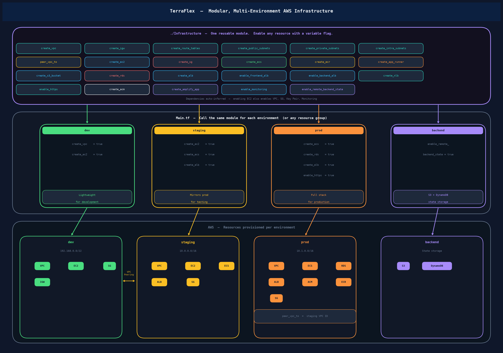

# TerraFlex

A modular, feature-flag-driven Terraform framework for provisioning AWS infrastructure. Every AWS service is opt-in via a boolean toggle variable — the `./Infrastructure` composite module wires all dependencies automatically. Call the same module as many times as you need to create separate environments or resource groups.

**Provider:** `hashicorp/aws ~> 5.48.0` | **Default region:** `us-east-2`

---

## Architecture



---

## Module Structure

```
TerraFlex/
├── Main.tf                   # Root — module calls (one per environment / resource group)
├── Variables.tf              # AWS credentials, region, github_token
├── Outputs.tf                # Route table IDs from both VPCs
├── Providers.tf              # AWS provider + default tags
├── Terraform.tf              # Backend config (S3 + DynamoDB)
├── Import.tf                 # Import block for DynamoDB lock table
│
└── Infrastructure/           # Reusable composite module
    ├── main.tf               # Conditional sub-module instantiation
    ├── variables.tf          # All input variables with defaults
    ├── locals.tf             # Dependency auto-inference logic
    ├── outputs.tf            # VPC IDs, CIDRs, route table IDs
    │
    ├── REMOTE-BACKEND/       # S3 + DynamoDB state backend
    ├── VPC/                  # VPC, subnets, IGW, route tables
    ├── VPC-PEERING/          # Peering connection + bidirectional routes
    ├── SECURITY-GROUPS/      # Security group with fixed + dynamic ICMP rules
    ├── KEY-PAIR/             # RSA-4096 key pair + local .pem file
    ├── EC2/                  # EC2 + IAM instance profile (CloudWatch agent)
    ├── ALB/                  # ALB + HTTP→HTTPS redirect + frontend/backend TGs
    ├── NLB/                  # NLB + TCP listener
    ├── RDS/                  # RDS instance + subnet group
    ├── ACM/                  # ACM TLS certificate (email validation)
    ├── AMPLIFY/              # Amplify app + branch
    ├── ECS/                  # ECS Fargate cluster + task + service
    ├── ECR/                  # ECR repository + lifecycle policy
    ├── APP-RUNNER/           # App Runner service + IAM role
    ├── MONITORING/           # CloudWatch, CloudTrail, SNS, S3 audit logs
    └── S3/                   # General-purpose S3 bucket
```

---

## Deployed Environments

The root `Main.tf` calls `./Infrastructure` once per environment:

| Module | Purpose | Key Resources |
|---|---|---|
| `prd-remote-backend` | Bootstrap Terraform state | S3 bucket + DynamoDB table |
| `prd-first` | Primary workload VPC | VPC `192.168.0.0/22`, 2 public subnets, EC2 `t3.small`, SG, key pair, monitoring |
| `prd-second` | Secondary / peered VPC | VPC `192.168.4.0/22`, 2 public subnets, EC2 `t3.small`, SG, VPC peering to `prd-first` |

### VPC Peering

Both VPCs are peered with `auto_accept = true`. Bidirectional routes are injected into all route tables of both VPCs. ICMP (ping) is allowed across the peering link for connectivity validation using `icmp_ingress_cidrs`.

---

## Feature Flags

Every resource is opt-in. Pass `true` to enable:

### Networking

| Variable | Resource Created |
|---|---|
| `create_vpc` | VPC |
| `create_igw` | Internet Gateway |
| `create_route_tables` | Route tables |
| `create_public_subnets` | Public subnets |
| `create_private_subnets` | Private subnets |
| `create_intra_subnets` | Intra-service subnets (isolated, no internet) |
| `peer_vpc_to` | VPC peering connection — pass the peer VPC ID as value |

### Compute & Containers

| Variable | Resource Created |
|---|---|
| `create_ec2` | EC2 instance, key pair, IAM instance profile |
| `create_sg` | Security group |
| `create_ecs` | ECS Fargate cluster + task definition + service |
| `create_ecr` | ECR container registry + lifecycle policy |
| `create_app_runner` | App Runner service + IAM role |

### Load Balancing

| Variable | Resource Created |
|---|---|
| `create_alb` | Application Load Balancer |
| `enable_frontend_alb` | ALB frontend target group + listener rule |
| `enable_backend_alb` | ALB backend target group + listener rule (`/api/*`) |
| `create_nlb` | Network Load Balancer (TCP) |
| `enable_https` | HTTPS listener on ALB (requires `create_acm = true`) |

### Data & Storage

| Variable | Resource Created |
|---|---|
| `create_rds` | RDS instance + subnet group |
| `create_s3_bucket` | General-purpose S3 bucket |

### Other

| Variable | Resource Created |
|---|---|
| `create_acm` | ACM TLS certificate (email validation) |
| `create_amplify_app` | Amplify app + branch |
| `enable_monitoring` | CloudWatch logs + alarms, CloudTrail, SNS, S3 audit logs |
| `enable_remote_backend_state` | S3 state bucket + DynamoDB lock table |

### Automatic Dependency Resolution

`locals.tf` auto-enables dependent resources so callers don't need to set them manually:

| When you enable... | These are also auto-enabled |
|---|---|
| `create_ec2`, `create_rds`, `create_alb`, `create_nlb`, or `create_ecs` | VPC |
| `create_ec2`, `create_rds`, `create_alb`, or `create_ecs` | Security group |
| `create_ec2` | Key pair |
| `create_alb` or `create_nlb` | EC2 |
| `create_alb` or `create_ecs` + `enable_https` | ACM certificate |
| `create_ec2`, `create_alb`, or `create_ecs` | Monitoring |
| `create_ecs`, `create_ecr`, or `create_app_runner` | ECR |

---

## Prerequisites

- [Terraform](https://developer.hashicorp.com/terraform/downloads) >= 1.5
- AWS credentials with sufficient IAM permissions
- Deploy `prd-remote-backend` first — the S3 bucket and DynamoDB table must exist before other modules run

---

## Usage

### 1. Bootstrap the remote backend

```hcl
module "prd-remote-backend" {
  source       = "./Infrastructure"
  project_name = "remote-backend"
  env          = "prd"

  enable_remote_backend_state = true
}
```

```bash
terraform init
terraform apply -target=module.prd-remote-backend
```

### 2. Deploy a VPC with an EC2 instance

```hcl
module "prd-first" {
  source       = "./Infrastructure"
  project_name = "first"
  env          = "prd"
  region       = "us-east-2"

  create_vpc          = true
  vpc_cidr            = "192.168.0.0/22"
  azs                 = ["us-east-2a", "us-east-2b"]
  create_public_subnets = true
  public_subnet_cidrs = ["192.168.0.0/26", "192.168.0.64/26"]

  create_sg  = true
  create_ec2 = true
  ec2_os_type       = "linux"
  ec2_instance_type = "t3.small"
  ec2_public_ip     = true
}
```

### 3. Peer two VPCs

```hcl
module "prd-second" {
  source       = "./Infrastructure"
  project_name = "second"
  env          = "prd"

  create_vpc          = true
  vpc_cidr            = "192.168.4.0/22"
  azs                 = ["us-east-2a", "us-east-2b"]
  create_public_subnets = true
  public_subnet_cidrs = ["192.168.4.0/26", "192.168.4.64/26"]

  peer_vpc_to        = module.prd-first.vpc_id
  icmp_ingress_cidrs = ["192.168.0.0/22"]

  create_sg  = true
  create_ec2 = true
  ec2_os_type   = "linux"
  ec2_public_ip = true
}
```

### 4. Add optional services

```hcl
module "prd-first" {
  # ... base config above ...

  create_ecs          = true
  create_ecr          = true
  create_alb          = true
  enable_frontend_alb = true
  enable_backend_alb  = true
  frontend_port       = 80
  backend_port        = 4000
  enable_https        = true
  create_acm          = true
  acm_domain          = "example.com"

  create_rds        = true
  rds_engine        = "postgres"
  rds_instance_class = "db.t3.micro"
}
```

---

## Key Variables

| Variable | Default | Description |
|---|---|---|
| `project_name` | — | Prefix for all resource names (required) |
| `env` | `"dev"` | Environment label (e.g. `dev`, `staging`, `prd`) |
| `region` | `"east-us-2"` | AWS deployment region |
| `vpc_cidr` | `"10.0.0.0/16"` | VPC CIDR block |
| `azs` | `["us-east-2a", "us-east-2b"]` | Availability zones for subnets |
| `ec2_os_type` | `"linux"` | OS for EC2: `linux`, `windows`, `mac` |
| `ec2_instance_type` | `"t3.small"` | EC2 instance type |
| `ec2_public_ip` | `false` | Assign a public IP to the EC2 instance |
| `rds_engine` | `"postgres"` | RDS engine: `postgres` or `mysql` |
| `rds_engine_version` | `"15.4"` | RDS engine version |
| `rds_instance_class` | `"db.t3.micro"` | RDS instance class |
| `rds_allocated_storage` | `20` | RDS storage in GB |
| `frontend_port` | `80` | ALB frontend target group port |
| `backend_port` | `4000` | ALB backend target group port |
| `alert_email` | `"bsuryateja777@gmail.com"` | SNS alarm recipient |
| `icmp_ingress_cidrs` | `[]` | CIDRs allowed for ICMP (used to validate VPC peering) |
| `peer_vpc_to` | `null` | VPC ID to peer with |
| `enable_https` | `false` | Enable HTTPS listener on ALB |
| `log_retention_days` | `30` | CloudWatch log retention period |

---

## Outputs

| Output | Description |
|---|---|
| `vpc_id` | ID of the provisioned VPC |
| `vpc_cidr_block` | CIDR block of the VPC |
| `vpc_a_rt_ids` | Route table IDs of the first VPC (used for peering routes) |
| `vpc_b_rt_ids` | Route table IDs of the second VPC (used for peering routes) |

---

## State Management

Terraform state is stored remotely:

| Resource | Name |
|---|---|
| S3 bucket | `tfstate-terraflex-remote-backend` |
| DynamoDB table | `dynamodb-terraflex-remote-backend-locks` |

Both have `prevent_destroy = true`, versioning enabled, and AES256 encryption.

---

## Default Tags

All resources receive these tags automatically via provider-level `default_tags`:

```hcl
Project    = "Terra Flex"
Owner      = "Surya Teja Reddy"
ManagedBy  = "Terraform"
```

---

## Security Notes

- Security groups allow SSH (22), HTTP (80), HTTPS (443), and app ports (4000, 5000) from `0.0.0.0/0` — restrict these CIDRs for production use.
- The RDS default password (`admin12345`) should be replaced with AWS Secrets Manager or a Terraform variable marked `sensitive = true`.
- ACM uses email validation, which requires manually clicking the verification email link.
- EC2 SSH private keys are written to `Infrastructure/KEY-PAIR/keys/` — add this path to `.gitignore`.
